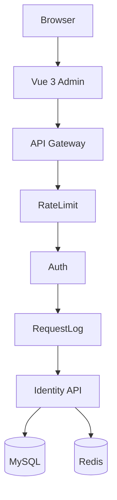
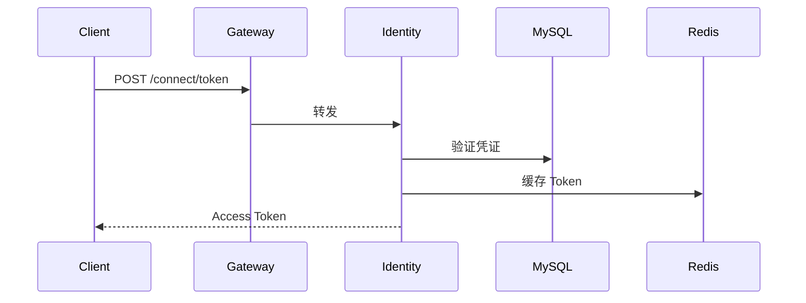

# Architecture Skill

## 项目架构

Dawning 采用 **DDD 分层架构**：

```
┌─────────────────────────────────────────────────┐
│              Presentation Layer                  │
│  dawning-admin (Vue 3)  │  Gateway.Api          │
│                         │  Identity.Api          │
├─────────────────────────────────────────────────┤
│              Application Layer                   │
│         Identity.Application                     │
│    (Services, DTOs, Commands, Queries)           │
├─────────────────────────────────────────────────┤
│                Domain Layer                      │
│  Identity.Domain  │  Identity.Domain.Core        │
│  (Entities)       │  (Base, Interfaces)          │
├─────────────────────────────────────────────────┤
│             Infrastructure Layer                 │
│  Infra.Data  │  Infra.Mapping  │  Infra.Messaging│
│  (Dapper)    │  (AutoMapper)   │  (RabbitMQ)     │
├─────────────────────────────────────────────────┤
│            Cross-Cutting (SDK Packages)          │
│  Core │ Extensions │ Identity │ Caching │ ...    │
└─────────────────────────────────────────────────┘
```

## Gateway 项目结构

```
apps/gateway/src/
├── Dawning.Gateway.Api/                    # API 网关 (YARP)
├── Dawning.Gateway.Middleware/             # 限流、日志、鉴权
├── Dawning.Identity.Api/                   # 身份认证 (OpenIddict)
├── Dawning.Identity.Application/           # 应用服务层
├── Dawning.Identity.Domain/                # 领域模型
├── Dawning.Identity.Domain.Core/           # 领域核心
├── Dawning.Identity.Infra.Data/            # Dapper + MySQL
├── Dawning.Identity.Infra.CrossCutting.IoC/
├── Dawning.Identity.Infra.CrossCutting.Mapping/
└── Dawning.Identity.Infra.Messaging/
```

## SDK 包结构

```
sdk/
├── Dawning.Core/        # 异常、中间件、统一结果
├── Dawning.Extensions/  # 字符串、集合、JSON
├── Dawning.Identity/    # JWT、用户上下文
├── Dawning.Caching/     # 内存缓存、Redis
├── Dawning.Logging/     # 结构化日志
├── Dawning.Messaging/   # RabbitMQ、Service Bus
├── Dawning.ORM.Dapper/  # Dapper 增强
└── Dawning.Resilience/  # 重试、熔断
```

## Mermaid 模板

### 系统架构图



### 认证流程



