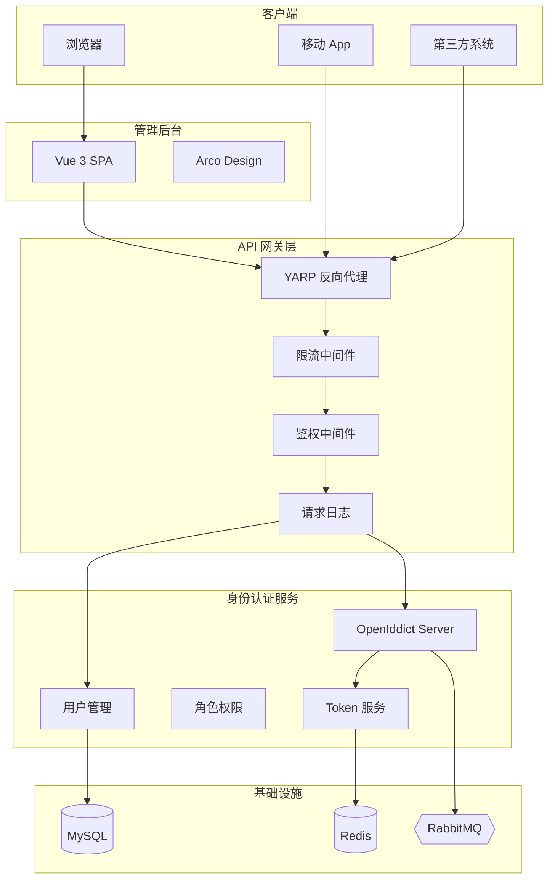
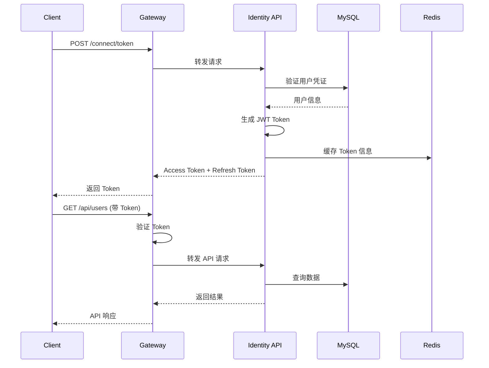
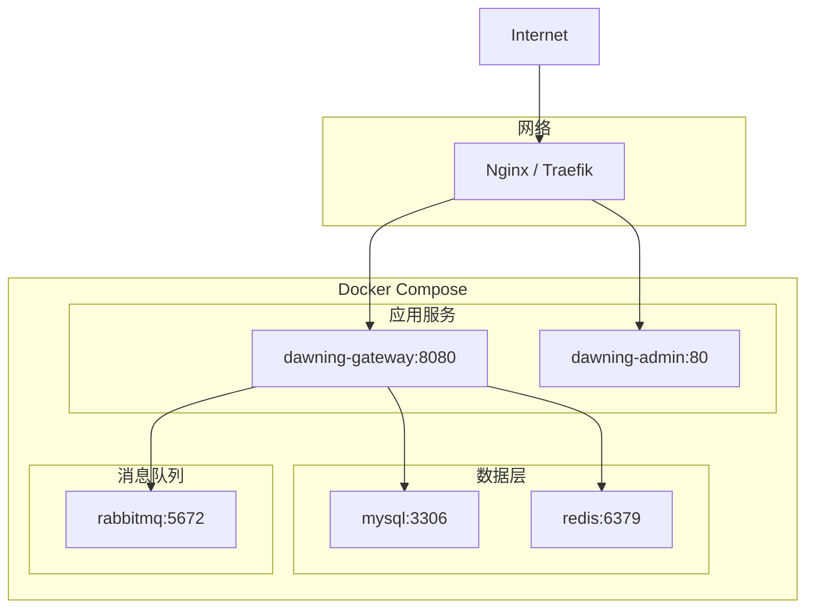

# 生成项目架构

根据代码分析生成项目架构图、架构文档或架构说明。

## 适用场景

- 生成系统架构图（Mermaid/PlantUML）
- 编写架构设计文档
- 分析模块依赖关系
- 生成 API 架构图
- 生成部署架构图

## 项目架构概览

### 整体架构

Dawning 采用 **DDD (领域驱动设计)** 分层架构：

```
┌─────────────────────────────────────────────────────────────┐
│                      Presentation Layer                      │
│  ┌─────────────────┐  ┌─────────────────────────────────┐   │
│  │  dawning-admin  │  │      Dawning.Gateway.Api        │   │
│  │    (Vue 3)      │  │   Dawning.Identity.Api          │   │
│  └─────────────────┘  └─────────────────────────────────┘   │
├─────────────────────────────────────────────────────────────┤
│                      Application Layer                       │
│  ┌─────────────────────────────────────────────────────┐    │
│  │           Dawning.Identity.Application              │    │
│  │     (Services, DTOs, Commands, Queries)             │    │
│  └─────────────────────────────────────────────────────┘    │
├─────────────────────────────────────────────────────────────┤
│                        Domain Layer                          │
│  ┌─────────────────────┐  ┌─────────────────────────┐       │
│  │ Identity.Domain     │  │ Identity.Domain.Core    │       │
│  │ (Entities, Rules)   │  │ (Base, Interfaces)      │       │
│  └─────────────────────┘  └─────────────────────────┘       │
├─────────────────────────────────────────────────────────────┤
│                     Infrastructure Layer                     │
│  ┌──────────────┐ ┌──────────────┐ ┌──────────────────┐     │
│  │ Infra.Data   │ │Infra.Mapping │ │ Infra.Messaging  │     │
│  │  (Dapper)    │ │ (AutoMapper) │ │ (RabbitMQ/etc)   │     │
│  └──────────────┘ └──────────────┘ └──────────────────┘     │
├─────────────────────────────────────────────────────────────┤
│                      Cross-Cutting Layer                     │
│  ┌─────────────────────────────────────────────────────┐    │
│  │              Dawning SDK Packages                   │    │
│  │  Core | Extensions | Identity | Caching | Logging   │    │
│  │  Messaging | ORM.Dapper | Resilience                │    │
│  └─────────────────────────────────────────────────────┘    │
└─────────────────────────────────────────────────────────────┘
```

### Gateway 服务架构

```
apps/gateway/src/
├── Dawning.Gateway.Api/           # API 网关入口 (YARP 反向代理)
├── Dawning.Gateway.Middleware/    # 网关中间件 (限流、日志、鉴权)
├── Dawning.Identity.Api/          # 身份认证 API (OpenIddict)
├── Dawning.Identity.Application/  # 应用服务层
├── Dawning.Identity.Domain/       # 领域模型层
├── Dawning.Identity.Domain.Core/  # 领域核心层
├── Dawning.Identity.Infra.Data/   # 数据访问层 (Dapper + MySQL)
├── Dawning.Identity.Infra.CrossCutting.IoC/     # 依赖注入
├── Dawning.Identity.Infra.CrossCutting.Mapping/ # 对象映射
└── Dawning.Identity.Infra.Messaging/            # 消息队列
```

### SDK 组件架构

```
sdk/
├── Dawning.Core/        # 核心：异常、中间件、统一结果
├── Dawning.Extensions/  # 扩展：字符串、集合、JSON 扩展方法
├── Dawning.Identity/    # 身份：JWT 解析、用户上下文
├── Dawning.Caching/     # 缓存：内存缓存、Redis
├── Dawning.Logging/     # 日志：结构化日志、请求追踪
├── Dawning.Messaging/   # 消息：RabbitMQ、Azure Service Bus
├── Dawning.ORM.Dapper/  # ORM：Dapper 增强、分页
└── Dawning.Resilience/  # 弹性：重试、熔断、超时
```

## 生成架构图

### Mermaid 系统架构图



### Mermaid 认证流程图



### Mermaid 部署架构图



## 生成架构文档模板

### 系统架构设计文档

```markdown
# {项目名称} 架构设计文档

## 1. 概述
- 项目背景
- 设计目标
- 技术选型

## 2. 系统架构
### 2.1 整体架构
[整体架构图]

### 2.2 技术架构
- 后端技术栈
- 前端技术栈
- 中间件

### 2.3 部署架构
[部署架构图]

## 3. 模块设计
### 3.1 网关模块
- 功能描述
- 核心组件
- 接口设计

### 3.2 身份认证模块
- OAuth 2.0 流程
- Token 管理
- 权限控制

### 3.3 用户管理模块
- 用户 CRUD
- 角色管理
- 权限分配

## 4. 数据架构
### 4.1 数据库设计
- ER 图
- 核心表结构

### 4.2 缓存策略
- 缓存数据
- 失效策略

## 5. 接口设计
### 5.1 API 规范
- RESTful 设计
- 统一响应格式

### 5.2 核心 API
- 认证 API
- 用户 API
- 角色 API

## 6. 安全设计
- 认证机制
- 授权策略
- 数据安全

## 7. 部署方案
- Docker 部署
- K8s 部署
- CI/CD 流程
```

## 使用示例

### 生成 Mermaid 架构图

**提示词**: 
> 帮我生成一个 Mermaid 格式的系统架构图，展示 Gateway 和 Identity 服务之间的关系

### 生成 C4 模型图

**提示词**:
> 用 C4 模型的 Container 图展示 Dawning 系统的容器级别架构

### 生成模块依赖图

**提示词**:
> 分析 Gateway 项目的模块依赖关系，生成依赖关系图

### 生成数据流图

**提示词**:
> 生成用户登录的数据流图，从前端到后端数据库

## 输出格式

生成的架构内容应包含：

1. **架构图** - Mermaid/PlantUML 格式
2. **说明文档** - 对架构的文字描述
3. **组件清单** - 各组件的职责说明
4. **交互说明** - 组件间的交互方式

## 注意事项

- 架构图应清晰展示系统边界
- 使用一致的命名规范
- 标注关键的数据流向
- 区分同步和异步通信
- 标注外部依赖和第三方服务
